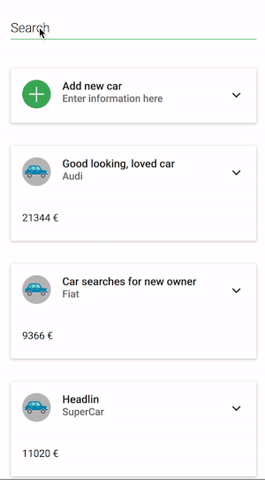

# Sell-Your-Car &middot; [](https://travis-ci.org/PetrykowskiM/sell-your-car)

A demo application to add cars online.

<p align="center">
  
</p>

## Thoughts regarding to...

### ...404 Pages and Page Views

Page Views can simply be tracked by using some kind of analytics tool like for
Example Google Analytics. An Event would be send from the client to the
analytics server. 404 Errors might come up in two different ways. Either a
frontend call by an actual user, who tries to access a non existing path, or
through a server that wants to access a non existing api resource. For every
404-Browser Request one can deliver a 404-Page, that contains an analytics
tracking token that sends a 404-Pageview to the analytics platform. According to
backend requests one might not deliver an actual page, but would respond with
the status code only. Analytics platforms can also be addressed by the backend.
Therefore one would simply send a tracking-event from the backend to the
analytics platform. Those platforms allow you to create various kind of
dashboards aggregating the send data.

On the other hand one could also achieve a Dashboard of Page Views and 404
responses by logging requested urls and responses an the backend site. Those
logs can be aggregated and visualized with the use of a log visualization tool.

### ... Service availability monitoring

Lets assume our service as an example. It obviously consists of two parts, that
need to be monitored.

1.  Frontend
2.  Backend

Both have different definitions of when the service is healthy. Regarding the
frontend we want the frontend to be reachable under a certain url. If it is, the
service is healthy. In other words, frontend is healthy if the url request
serves a Status-200 page.

Regarding the backend, it should also provide a dedicated url to check for its
health status. If its healthy it should return a Status 200 otherwise some other
status. On Request of this Server-Status url it should check the internals of
the backend. In our case we might check one or more of mongodbs diagnostic
queries in order to guarntee a working db. If they are fine we can respond with
a 200-Status message. If there is something wrong with the server it would not
be able to respond with a 200-Status so it wont be reachable and fail directly.

Now that we have our status routes, we could use a service that calls them on a
regular basis and notifies us in some way. An example service could be
[Uptimerobot](uptimerobot.com).

### ... Scalability

I use docker for this setup. Frontend, Backend and database are decoupled from
each other to allow individual scalability. This allows to scale up one part if
it is necessary. The services are connected by an nginx server that forwards
requests based on url rules to the services. Docker-compose also provides a neat
scaling feature that makes it easy to have multiple instances of one service
running.

### ... Static Deployment

The use of the nginx also allows us to easily provide static content, which
could either be provided by a static content docker container or by placing the
static files on the running docker machine and mount that into the nginx docker
container and let it being served by nginx directly.

## Docker Compose Setup

To run the setup completely I also provide a docker-compose setup. In order to
run it, you need to make sure to have `docker` and `docker-compose` installed.
Check their documentation on how to install it.

Once you have a running docker version you need to build and run the images.
Execute the following commands from the root directory:

```
docker-compose build
docker-compose up
```

If the commands execute successfully you should see logs from the database, the
frontend as well as the backend. **Make sure to have port 80 free on your local
machine**. If not change the nginx-port in the docker-compose file from `80:80`
to for example `8888:80`

Visit (localhost)[http://localhost].

## Database

The backend runs with a MongoDB Database. It can be started from the root
directory with

```
docker-compose up database
```

This starts the database and makes it available through the standard MongoDB
Port `27017`.

## Backend

### Technology-Stack

* MongoDB
* Express-Server

### Run

Go to Folder _Backend_ and do the following:

1.  Install Dependencies with `yarn` or `npm install`
2.  The Backend needs a mongodb instance to connect with. You can either set an
    environment variable on your computer to set the host with
    `export DB_HOST=192.168.1.123` on mac. Otherwise you can also start the
    database on your local machine by using the provided docker-compose setup.
    See more in the Database section.
3.  Start application with `yarn start` or `npm run start`

### Routes

Providing a REST-Interface to insert car, get all existing cars as well as the
details for one car

**GET** _/cars_ : Array of cars

**GET** _/cars/:carId_ : Details of one car

**POST** _/cars_ : Create new Car

### Tests

To run the test perform the following steps:

1.  Start the database from the root directory with `docker-compose up database`
2.  Run the script in _Backend/package.json_ by changing to Backend dir and run
    the script with

```
cd Backend
yarn test
```

or if you prefer npm

```
cd Backend
npm run test
```

## Frontend

### Technology-Stack

* React
* Redux

### Run

Go to Folder _frontend_ and do the following:

1.  Install Dependencies with `yarn` or `npm install`
2.  Start application with `yarn start` or `npm run start`

### Build

To create a deliverable application go to Folder _frontend_ and execute
`yarn build --production` or `npm run build --production`

### Tests

The frontend is provided with unit-tests. Go to Folder _frontend_ and execute
`yarn test` or `npm run test`

### Flow

Go to Folder _frontend_ and execute `yarn flow` or `npm run flow`
